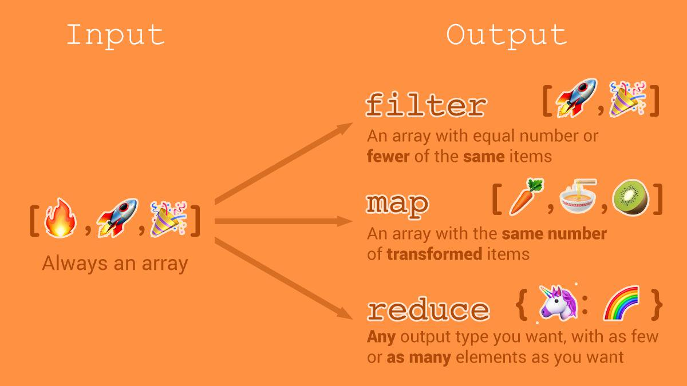

`.filter()`, `.map()`, `.reduce()`, আলাদা ভাবে operate করা যায় কিংবা একসাথে চেইন করে ও ব্যবহার করা যায়। এই method গুলা array কে operate করে transform করে একটা নতুন result এ। 

<!-- <p align="center">
  
</p> -->

## Filter

`filter()` একটা নতুন array তৈরী করে যে element গুলা callback function এর implemented test pass করে তাদের নিয়ে। 

```js{24,25,26}
const customers = [
    {
        name: "Mr. A",
        age: 21
    },
    {
        name: "Mr. B",
        age: 35
    },
    {
        name: "Mr. C",
        age: 18
    },
    {
        name: "Mr. D",
        age: 50
    },
    {
        name: "Mr. E",
        age: 25
    }
];

const result = customers.filter(function(elem){
    return elem.age >= 20 && elem.age <= 35;
});

console.log(
    JSON.stringify(result)
); // [{"name":"Mr. A","age":21},{"name":"Mr. B","age":35},{"name":"Mr. E","age":25}]

```

এইখানে আমরা customers array কে `filter` করেছি। আমরা ওই সব customer return পাবো যাদের age ***20*** থেকে ***35*** এর মধ্যে(inclusive)। 

আমরা উপরের code টা যদি ***ES6*** এর fat arrow function এ convert করি তাহলে code টা নিচের মতো হবে। 

```js{1}
const result = customers.filter((elem) => elem.age >= 20 && elem.age <= 35);

console.log(
    JSON.stringify(result)
); // [{"name":"Mr. A","age":21},{"name":"Mr. B","age":35},{"name":"Mr. E","age":25}]
```

## Map

`map()` একটা নতুন array তৈরী করে প্রত্যেকটা element এর জন্যে একটা callback function call করে।

```js{24,25,26,27,28}
const customers = [
    {
        firstName: "John",
        lastName: "Smith"
    },
    {
        firstName: "Joe",
        lastName: "Smith"
    },
    {
        firstName: "Bob",
        lastName: "Smith"
    },
    {
        firstName: "Mike",
        lastName: "Smith"
    },
    {
        firstName: "Juan",
        lastName: "Smith"
    }
];

const result = customers.map(function(elem) {
    return {
        fullName: `${elem.firstName} ${elem.lastName}`
    }
});

console.log(
    JSON.stringify(result)
); // [{"fullName":"John Smith"},{"fullName":"Joe Smith"},{"fullName":"Bob Smith"},{"fullName":"Mike Smith"},{"fullName":"Juan Smith"}]
```
এইখানে customer দের `firstName` এবং `lastName` আছে আমরা `map()` method ব্যবহার করে প্রত্যেক customer এর `fullName` তৈরী করতে পারি একটা নতুন এরে তে।

আমরা উপরের code টা যদি ***ES6*** এর fat arrow function এ convert করি তাহলে code টা নিচের মতো হবে। 

```js{1}
const result = customers.map((elem) => ({ fullName: `${elem.firstName} ${elem.lastName}` }));

console.log(
    JSON.stringify(result)
); // [{"fullName":"John Smith"},{"fullName":"Joe Smith"},{"fullName":"Bob Smith"},{"fullName":"Mike Smith"},{"fullName":"Juan Smith"}]
```

আমরা `map()` করার পর callback function এ যে কোনো type return করতে পারি (`Array`, `Object`, `String`, etc)। একটা code করে দেখি

```js
const customers = [
    {
        firstName: "John",
        lastName: "Smith"
    },
    {
        firstName: "Joe",
        lastName: "Smith"
    },
    {
        firstName: "Bob",
        lastName: "Smith"
    },
    {
        firstName: "Mike",
        lastName: "Smith"
    },
    {
        firstName: "Juan",
        lastName: "Smith"
    }
];

const result = customers.map(function(elem) {
    return elem.firstName.concat(" ", elem.lastName).length;
});

console.log(
    JSON.stringify(result)
); // [10,9,9,10,10]
```

এইখানে আমরা customer এর `firstName`, `lastName` কে [concat] করে তার length return করেছি। 

## Reduce

`reduce()` method একটা reducer function run করে প্রত্যেক element এর জন্যে এবং একটা single result return করে। `filter` method তার argument এ একটা callback function এবং একটা initial value except করে। 

```js{16,17,18}
const items = [
    {
        quantity: 1,
        price: 20
    },
    {
        quantity: 5,
        price: 200
    },
    {
        quantity: 7,
        price: 100
    }
];

const total = items.reduce(function(accumulator, currentValue){
    return accumulator + (currentValue.quantity * currentValue.price)
}, 0);

console.log(total); // 1720
```
এইখানে আমরা accumulator এ ***`0`*** set করেছি। প্রত্যেকটা item এর `quantity` এবং `price` গুন করে এবং accumulator এর সাথে যোগ করে একটা single result `total` পেয়েছি। 

আমরা উপরের code টা যদি ***ES6*** এর fat arrow function এ convert করি তাহলে code টা নিচের মতো হবে। 

```js{1,2,3,4}
const total = items.reduce(
    (accumulator, currentValue) => accumulator + (currentValue.quantity * currentValue.price),
    0
);

console.log(total); // 1720
```

## filter, map, reduce

এখন আমরা `filter`, `map`, `reduce` use করে একটা code করে দেখবো। code করার আগে একটা case বলি 

আমাদের কাছে একটা eCommerce business এর orders এর data আছে। আমাদের কে ওই orders থেকে যে সব order এর status `ACCEPTED` এবং customer এর age **`20`** থেকে **`30`** এর মধ্যে, তাদের কাছে আমরা কতো টাকা sell করতে পেরেছি সেটা বের করতে হবে। 
আমরা প্রথমে একটা একটা function use করে result বের করবো তার পর function chain করে result বের করবো। 

```js
const orders = [
    {
        customer: {
            id: "A1",
            age: 20
        },
        status: "ACCEPTED",
        items: [
            {
                quantity: 1,
                price: 20
            }
        ]
    },
    {
        customer: {
            id: "B1",
            age: 25
        },
        status: "ACCEPTED",
        items: [
            {
                quantity: 5,
                price: 200
            }
        ]
    },
    {
        customer: {
            id: "A1",
            age: 20
        },
        status: "REJECTED",
        items: [
            {
                quantity: 1,
                price: 20
            },
            {
                quantity: 5,
                price: 200
            },
            {
                quantity: 7,
                price: 100
            }
        ]
    },
    {
        customer: {
            id: "C1",
            age: 35
        },
        status: "ACCEPTED",
        items: [
            {
                quantity: 1,
                price: 10
            },
            {
                quantity: 5,
                price: 250
            },
            {
                quantity: 7,
                price: 50
            }
        ]
    },
    {
        customer: {
            id: "A1",
            age: 20
        },
        status: "ACCEPTED",
        items: [
            {
                quantity: 3,
                price: 200
            }
        ]
    }
];
```

তাহলে প্রথমে আমরা `ACCEPTED` order এবং যে সব customer দের age **`20`** থেকে **`30`** এর মধ্যে তাদের কে বের করি। 

```js{1,2,3}
const filterOrders = orders.filter(function(elem){
    return elem.status === "ACCEPTED" && elem.customer.age >= 20 && elem.customer.age <= 30;
});

console.log(filterOrders); // [{"customer":{"id":"A1","age":20},"status":"ACCEPTED","items":[{"quantity":1,"price":20}]},{"customer":{"id":"B1","age":25},"status":"ACCEPTED","items":[{"quantity":5,"price":200}]},{"customer":{"id":"A1","age":20},"status":"ACCEPTED","items":[{"quantity":3,"price":200}]}]
```
এখন আমরা প্রত্যেক order এর total price calculate করবো। 

```js{1,2,3,4,5,6,7}
const mapOrders = mapOrders = filterOrders.map(
    function(elem) {
        return elem.items.reduce(function(accumulator, currentValue){
            return accumulator + (currentValue.quantity * currentValue.price);
        }, 0)
    }
);

console.log(mapOrders); // [20, 1000, 600]
```

এখন আমরা সব গুলা value যোগ করলে আমাদের result পেয়ে যাবো। 

```js{1,2,3}
const totalSell = mapOrders.reduce(function(accumulator, currentValue){
    return accumulator + currentValue;
}, 0);

console.log(totalSell); // 1620
```

এখন আমরা এই পুরো কাজটা chain function এবং ***ES6*** এর fat arrow function use করে এই একই কাজটা করে দেখবো। 


```js{1,2,3,4}
const totalSell = orders
    .filter(elem => elem.status === "ACCEPTED" && elem.customer.age >= 20 && elem.customer.age <= 30)
    .map(elem => elem.items.reduce((accumulator, currentValue) => accumulator + (currentValue.quantity * currentValue.price), 0))
    .reduce((accumulator, currentValue) => accumulator + currentValue, 0);

console.log(totalSell); // 1620
```

[concat]: <https://developer.mozilla.org/en-US/docs/Web/JavaScript/Reference/Global_Objects/String/concat>