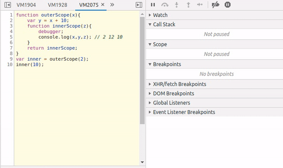
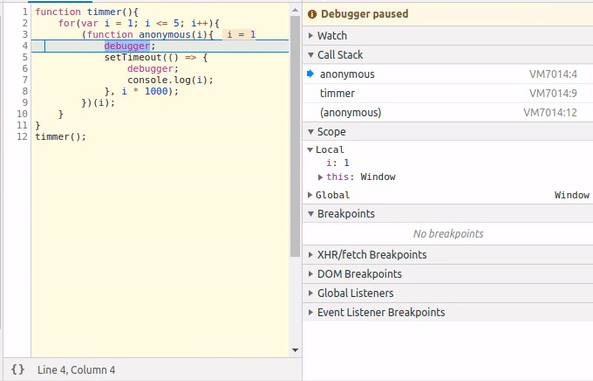

Closure বোঝার জন্যে আপনার JavsScript এর [scope] সম্পর্কে ধারণা থাকতে হবে। 

## Closure কি?

Closure হচ্ছে JavaScript এর এমন একটা mechanism যেটা function invoke/destroy হওয়ার পর ও parent function এর lexical scope মনে রাখে। অন্যভাবে বললে বলা যায়, closure থাকার কারণে আমরা inner function থেকে outer function এর scope এ access পেতে পারি। JavaScript এ function creation time এ প্রতিটি function এর জন্যে closure তৈরী হয়। 

[Scope] section এর একটা code দেখি। 

```js
// Global Scope

function outerScope(x){
	var y = x + 10;
	function innerScope(z){
		console.log(x,y,z); // 2 12 24
	}
	innerScope(x + y + 10);
}
outerScope(2);
```

এইখানে, `innerScope` function টা তে এর lexical scope এ থাকা সব কিছুর access আছে। কিন্তু এইটা তো scope এর কারণে হয়েছে closure কোথায়? এইখানে closure কোথায় এইটা আরো ভালো ভাবে বুঝতে হলে code টা কে একটু chnage করলেই দেখতে পারবেন closure। তাহলে কোড টা chnage করে দেখা যাক। 
 
```js{10,12}
// Global Scope

function outerScope(x){
	var y = x + 10;
	function innerScope(z){
		console.log(x,y,z); // 2 12 10
	}
	return innerScope;
}
var inner = outerScope(2);

inner(10);
```

এইখানে আমরা যেটা করেছি, `outerScope` function থেকে `innerScope` function কে return করিয়েছি। `outerScope` function কে invoke করে function এর return value টা `inner` variable এ store করেছি যেটা আসলে `innerScope` function। `inner` function invoke করার আগে আমরা একটু ভালো ভাবে লক্ষ করলে দেখতে পারবো, `outerScope` তো invoke করা হয়ে গেছে তাহলে `outerScope` function এর scope এ যে **`x`** এবং **`y`** variable আছে ঐটা আর থাকার কথা না, কিন্তু closure এর কারণে আমাদের কাছে `outerScope` function এর scope এর access আছে ঐটা destroy হয়ে যাওয়ার পরও। যার কারণে আমরা `inner` function call করে প্রতি বার `console.log` এ ***x***,***y***,***z*** এর value পাবো।

<p align="center">
  
</p>

## Loop, Scope & Closure

JavaScript এ code লেখে কিন্তু `setTimeout` use করেনি এমন developer নাই, সেজন্যেই [setTimeout] এবং `loop` use করে আমরা একটা code করে দেখবো। 

```js
function timmer(){
    for(var i = 1; i <= 5; i++){
        setTimeout(() => {
            console.log(i);
        }, i * 1000);
    }
}
timmer();
```
এইখানে আপনি কি expect করেছিলেন? `console.log` কি print করবে? `0,1,2,3,4`? না এইখানে এইরকম টা হবে না।  এইখানে ***5*** বার ***6*** print করবে, `1,2,..5` second পর পর। 

এইখানে, loop terminate হবে যখন ***`i <= 5`***। তারমানে console এ যে value টা দেখতে পাচ্ছি সেটা আসলে loop terminate হওয়ার পর ***`i`*** এর যে value হবে সেটা। তার  মানে এইখানে function টার জন্যে separate scope থাকলে আসলে আমরা যে output expect করেছিলাম সেটা পাওয়ার কথা। আর আমরা প্রতিটি loop এর iteration এ separate scope তৈরী করতে পারি [IIFE] use করে, অথবা `var` এর পরিবর্তে `let` use করে।

```js{3,4,5,6,7}
function timmer(){
    for(var i = 1; i <= 5; i++){
        (function anonymous() {
			setTimeout(() => {
                console.log(i);
            }, i * 1000);
        })();
    }
}
timmer();
```
এইখানে anonymous function দিয়ে lexical scope তৈরী করেছি ঠিকই কিন্তু scope টা empty ***`i`*** এর value anonymous function এর lexical scope এ নাই আছে এর বাইরের timmer function এর scope এ আর closure এর মধ্যেমে আমরা ওই ***`i`*** এর value টাই পাবো। আমরা তাহলে anonymous function এর scope এ একটা variable create করে কিংবা argument এ pass করে আমাদের কাজটা করতে পারি। তাহলে সেটাই করে দেখি আমাদের কাজ হয় কিনা। 

```js{3,4,5,6,7}
function timmer(){
    for(var i = 1; i <= 5; i++){
        (function anonymous(i) {
			setTimeout(() => {
                console.log(i);
            }, i * 1000);
        })(i);
    }
}
timmer();
```
হ্যা এবার কাজ হয়েছে কারণ anonymous function এর scope এ প্রতিবার আমরা ***`i`*** কে pass করে ওই scope এর জন্যে একটা কপি তৈরী করেছি যেটা closure এর মাধ্যমে আমরা পরে access করতে পারছি। 

JavaScript এর [debugger] statement use করে আমরা এই code টা  debug করে দেখি।

<p align="center">
  
</p>

> এই ধরণের code প্রোডাকশন লেবেল এ কখনোই লেখা উচিত না কেউ লেখো ও না। আমরা closure বোঝার জন্যে লিখেছি। 😂😂

## Module & Closure
অন্যান্য OOP language এর মতো JavaScript এ private method বা filed নাই, কিন্তু আমরা এইটা তৈরী করতে পারি closure থাকার কারণে। 

```js
function score(){
	var count = 0;
	function get(){
		return count;
	}
	function set(val){
		count += val;
	}

	return {
		increment: () => {
			set(1);
		},
		decrement: () => {
			set(-1);
		},
		value: () => {
			return get();
		}
	}
}
var player1 = score();
player1.increment();
player1.value(); // 1
```
এইখানে `increment`, `decrement`, `value` method গুলা একটা share environment use করতেছে যেখানে `count`, `set` এবং `get` variables হলো প্রাইভেট, বাইরে থেকে accessible না। `increment`, `decrement`, `value` এই 3 function lexical scope এর property use করতেছে closure এর মাধ্যমে।


[scope]: </javascript/understanding-scope-in-javascript>
[event loop]: <https://www.google.com/search?q=javascript+event+loop&oq=javascript+event+loop&aqs=chrome..69i57j0l5.6368j0j1&sourceid=chrome&ie=UTF-8>
[setTimeout]: <https://developer.mozilla.org/en-US/docs/Web/API/WindowOrWorkerGlobalScope/setTimeout>
[IIFE]: <https://developer.mozilla.org/en-US/docs/Glossary/IIFE>
[debugger]: <https://developer.mozilla.org/en-US/docs/Web/JavaScript/Reference/Statements/debugger>