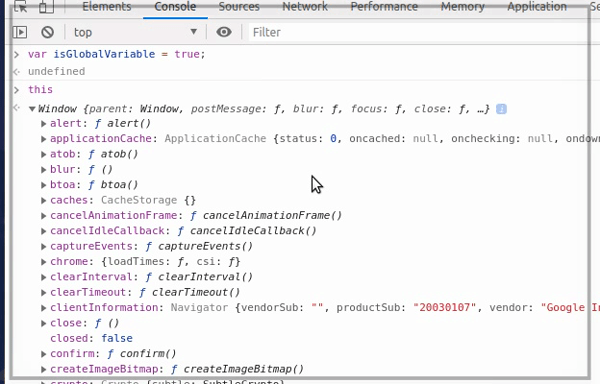

## Scope কি?

মোটামুটি সব গুলা প্রোগ্রামিং ল্যাঙ্গুয়েজে কিছু fundamental paradigms আছে, scope তার মধ্যে একটা। Scope এর মাধ্যমে প্রোগ্রাম থেকে variables এবং functions এর কোথায় access বা visibility আছে আর কোথায় access বা visibility নাই এইটা বোঝা যাবে। 

আর, কিভাবে এই scope কাজ করে এইটা বোঝা অনেক জরুরি। JavaScript এ ২ ধরণের scope আছে।

	- Global Scope (গ্লোবাল স্কোপ)
	- Local Scope (লোকাল স্কোপ)

## Global Scope(গ্লোবাল স্কোপ)

আপনি একটা ডকুমেন্ট open করে JavaScript code লেখা শুরু করেছেন মানে আপনি code টা global scope এ লিখছেন। NodeJs এর ক্ষেত্রে বেপার টা একটু অন্য রকম। NodeJs এর টপ লেবেল স্কোপ ব্রাউজার এর global scope এর মতো না, এইটা ওই module এর local scope। global scope এ declare করা variables, functions কোডের যেকোনো জায়গা থেকে application এর লাইফ টাইম পর্যন্ত access করা যায়। 

ব্রাউজার থেকে [DevTools open] করে নিচের code টা গ্লোবাল স্কোপ এ অ্যাড করে দেখি। 

```js
var isGlobalVariable = true;
```
এখন ব্রাউজার এর global object `this` টা দেখলে আমাদের declare করা variable টা ওইখানে পাবো, যেটা সব খান থেকে accessible।

<p align="center">
  
</p>


## তাহলে আমরা গ্লোবাল স্কোপ এ কখন ভ্যারিয়েবল ডিক্লেয়ার করতে পারি?

<p align="center">
  
</p>
<!--  -->

Global scope এ আমরা কখনো variable declare করবো না, করলে অন্য developer এর declare করা variable এর সাথে collisions হতে পারে। 
> হাজার হাজার developer এর লক্ষ লক্ষ variable, collision হয়ে যেতেই পারে 😜। 


## Local Scope (লোকাল স্কোপ) 

যখনি আমরা global scope এর মধ্যে আর একটা নতুন scope তৈরী করবো ঐটা local scope হবে। local scope এর ভ্যারিয়েবল গুলা শুধু মাত্র ওই scope এ access করা যাবে, global scope কিংবা অন্য কোনো local scope এ ঐটা access করা যাবে না। 

```js{5}
function localScope(){
	var localVariable = true;
}
localScope(); // invoked at Global Scope
console.log(localVariable); // ReferenceError: localVariable is not defined
```

JavaScript এর প্রত্যেকটি ফাংশন এক একটা local scope তৈরি করে। আর ফাঙ্কশন এর কাজ শেষ হওয়ার পর এই লোকাল ভ্যারিয়েবল গুলা ডিলিট করে দেয়। 

```js{13,18}
function outerLocalScope(){
	var outerVariable = true;
	
	function innerLocalScope(){
		var innerVariable = true;
		console.log("Inside innerLocalScope: outerVariable = ",outerVariable); // Inside innerLocalScope: outerVariable =  true
		console.log("Inside innerLocalScope: innerVariable = ",innerVariable); // Inside innerLocalScope: innerVariable =  true
	}

	innerLocalScope(); // invoked at first local Scope

	console.log("Inside outerLocalScope: outerVariable = ",outerVariable); // Inside outerLocalScope: outerVariable =  true
	console.log("Inside outerLocalScope: innerVariable = ",innerVariable); // ReferenceError: innerVariable is not defined
}

outerLocalScope(); // invoked at Global Scope

console.log("Outside localScope: ", outerVariable); // This line will not be executed due to an error.
```

এইখানে, আমরা outerLocalScope নামে global scope এ একটা function লিখেছি, যেই function এর local scope এ আর একটা function innerLocalScope লেখা হয়েছে। innerLocalScope function যখন invoke হবে তখন innerLocalScope function এর scope এ outerVariable এর referance নাই যার কারণে এই scope থেকে এক step বাইরের scope এ খুঁজবে outerVariable আছে কিনা।

হ্যা outerLocalScope function এর local scope এ outerVariable আছে `console.log` এ যথাক্রমে outerVariable এবং innerVariable print hobe হবে। কিন্তু outerLocalScope এর `console.log` এ শুধু মাত্র ওই scope এর variable `outerVariable` পাবে, `innerVariable` outerLocalScope function এর local scope এ নাই, আছে innerLocalScope function এর local scope এ যেটা invoke করার পর destroy/[call stack] থেকে বের হয়ে গেছে যার কারণে `ReferenceError` দিবে। 

## Lexical Scope (লেক্সিকাল স্কোপ)

Lexical Scope বলতে আসলে বোঝানো হয়েছে, যেখানে আপনার variable বা scope block `aka: {}` লেখা আছে। আমরা একটা code লিখে বেপারটা বোঝার চেষ্টা করবো। 

```js{4}
function outerScope(x){
	var y = x + 10;
	function innerScope(z){
		console.log(x,y,z); // 2 12 24
	}
	innerScope(x + y + 10);
}
outerScope(2);
```
এইখানে global scope এ একটা function লেখা হয়েছে যেটার নাম outerScope যেটা কল ও করা হয়েছে global scope থেকে, outerScope এর scope এ একটা local scope declare করা হয়েছে যেটার নাম innerScope, যেটা একই scope এর মধ্যে call করা হয়েছে। এখন innerScope function এর মধ্যে `console.log` যখন execute হবে তখন আসলে কি হবে?

`console.log` call হলে `x,y,z` referance variable গুলা খুঁজবে, প্রথমেই x কে খুঁজবে কিন্তু innerScope function এর scope এ x নাই, x কে খুঁজে পাবার জন্যে এক step বাইরে গিয়ে খুঁজবে, যেটা outerScope function এর scope ওর সব থেকে কাছের scope, যেখানে x এবং y variable টা পাবে, আর z তো innerScope এর scope এই আছে।

যতক্ষণ পর্যন্ত referance variable না পাবে ততোক্ষণ পর্যন্ত এক এক step বাইরে গিয়ে ওই scope এ খুঁজতে থাকবে global scope এ না যাওয়া পর্যন্ত, যদি কোনো referance variable মিলে যায় তাইলে ঐটা খোঁজা বন্ধ করে দিবে পরের step এ আর যাবে না। 

**Lecical Scope এর আর একটা code লিখে দেখি...**

```js{2}
function innerScope(z){
	console.log(x,y,z); // ReferenceError: x is not defined
}

function outerScope(x){
	var y = x + 10;
	innerScope(x + y + 10);
}

outerScope(2);
```
আমরা উপরের code টা কে একটু খারাপ ভাবে লিখেছি। **খারাপ** ভাবে কেন বলছি ঐটা পরে বলতেছি, কিন্তু আপনি `console.log` থেকে যেটা expect করেছিলেন সেটা হয়েছে কিনা ঐটা একবার মিলিয়ে দেখুন। 

হ্যা এই code `console.log` এ `ReferenceError` দেবে। **কেন...?** চলুন দেখি কেন?

আমি প্রথমেই বলেছিলাম lecical scope মানে আপনার code টা কোথায় লেখা আছে মানে code এর block scope কোথায়, এই না যে আপনার code কোথায় invoke/call হচ্ছে। 

```js{1,2,3}
function innerScope(z){
	console.log(x,y,z);
}
.
.
.
outerScope(2);
```
আপনি যদি একটু ভালো করে লক্ষ্য করেন তাহলে দেখবেন এই **খারাপ** code টা মানে innerScope function টা আসলে global scope এ লেখা আছে। এর আগে এই code টা  outerScope function এর local scope এ লেখা ছিল।  

এখন outerScope function থেকে innerScope function টা call যখন হবে তখন `console.log` referance variable ***`x`*** কে খুঁজবে যেটা ওই scope এ নাই, যার কারণে ওই scope টা একটা step scope বাইরে যাবে যেটা outerScope  function এর scope না।

outerScope এ innerScope function invoke/call হয়েছে কিন্তু function লেখা আছে global scope এ। তাহলে এক step বাইরের scope কোনটা হবে? হ্যা global scope, কিন্তু  global scope এ যাওয়ার পর ও ঐখানে ***`x`*** কে খুঁজে পাবে না যার কারণে এই `ReferenceError`।

**খারাপ code কেন বলেছি?**
> code কখনোই এমন ভাবে লেখা উচিত না যেটার কারণে code বুঝতে গিয়ে অন্য developer এর মাথার চুল ছিড়ে ফেলতে হবে।😂😂


## Block Scope (ব্লক স্কোপ)

ES6 আসার আগে JavaScript এ function block scope বাদে কোনো block scope ছিল না। আমরা যে এত সময় `var` keyword টা ব্যবহার করেছি সেটা এই কারণে। এখন আমরা দেখবো কি ভাবে function এর বাড়ে scope তৈরি করা যাই।

অন্নান্য language এ নিচের code টা reference error দিবে, কিন্তু JavaScript এ এইটা ঠিক আছে। কারণ JavaScript এ **`var`** keyword দিয়ে variable declare করলে এইটা এমন ভাবে treat করবে যেন এইটা function scope এ সবার প্রথম এ লেখা হয়েছে যদি function scope হয়। আর তা না হলে global scope এ সবার প্রথমে থাকবে যদি global scope হয়। আর এই ভাবে treat করা কে JavaScript এ [Hoisting] বলে।   

```js
if(true){
	var a = 10;
}
console.log(a); // 10
```

শুধু মাত্র **`let`** আর **`const`** block scope হিসাবে কাজ করে **`var`** করে না। 

```js{2,5}
{
	let a = 10;
}

console.log(a); // ReferenceError: a is not defined
```
loop এর block এ variable **`var`** keyword দিয়ে declare করলে এই variable loop block এর বাইরে থেকে access করা যাবে। 

```js{5}
for (var i = 0; i < 5; i++){
	console.log(i); // 0 1 2 3 4
}

console.log("After loop: ",i); // After loop:  5
```

কিন্তু **`let`**, **`const`** এর ক্ষেত্রে loop এর বাইরে থেকে use করা যাবেনা। 

```js{5}
for (let i = 0; i < 5; i++){
	console.log(i); // 0 1 2 3 4
}

console.log("After loop: ",i); // ReferenceError: i is not defined
```

মনে রাখতে হবে let, const দিয়ে একই scope এ একই নামে এক এর অধিক variable তৈরি করা যাবে না, তৈরি করলে Error দিবে। var দিয়ে তৈরি করা যাবে, কিন্তু করা bad practice.

[DevTools open]: <https://developers.google.com/web/tools/chrome-devtools/open>
[Hoisting]: </javascript/what-is-hoisting>
[call stack]: <https://developer.mozilla.org/en-US/docs/Glossary/Call_stack>