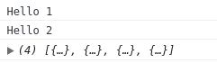
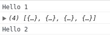

## Callback function কি?
যে কোনো function, যেটা ফাঙ্কশনের আর্গুমেন্ট হিসাবে পাঠানো হয় ঐটাই [callback](https://en.wikipedia.org/wiki/Callback_(computer_programming)?fbclid=IwAR0q8whAuIr10raKFlLpWaXcJjJPQk_IsPIK3C97yZN8DS7zQcgv-xGVPFU) function। একটা কলব্যাক function লিখি...
```js{2}
function myFunction(callback){
 callback();
}

// passing a function as an argument
myFunction(function(){
 console.log("Hello World.");
});
```

এইখানে `myFunction` একটা আর্গুমেন্ট এক্সপেক্ট করে। `myFunction` বডির নিচে যেখানে myFunction কল করা হয়েছে ওইখানে ফাঙ্কশনের আর্গুমেন্ট হিসাবে একটা [anonymous function](https://en.wikipedia.org/wiki/Anonymous_function?fbclid=IwAR2iRWZ_GAEfPTvmMdEn32C_iNWnYz0F_7QxsBig23bFwJY9z6XamGLjT84) পাঠানো হয়েছে যে ফাঙ্কশনটা Hello World. প্রিন্ট করে। আর এই [anonymous](https://en.wikipedia.org/wiki/Anonymous_function?fbclid=IwAR2iRWZ_GAEfPTvmMdEn32C_iNWnYz0F_7QxsBig23bFwJY9z6XamGLjT84) ফাঙ্কশনটাই একটা callback function। 

## Callback function কেন লাগবে?
Callback function ব্যবহার করা হয় যাতে অন্য কোডের কাজ শেষ হওয়ার পর এই ফাঙ্কশনের কাজ শুরু হয়। ২ টা ছোট কোড দেখি...
```js
function func1(){
    console.log("Hello 1");
}

function func2(){ 
    console.log("Hello 2"); 
}

func1(); // Hello 1
func2(); // Hello 2
```
এই ফাঙ্কশন ২ টা কল করলে ফার্স্টে Hello 1 এবং Hello 2 প্রিন্ট করবে। এইটা ঠিক আছে এইটাই হওয়ার কথা।কিন্তু তখন কি হবে যখন আমাদের একটা API রিকোয়েস্ট করে ওই রিকোয়েস্ট এর রেস্পন্সের জন্যে wait করতে হবে?
আমরা একটা API কল করে দেখি আসলে কি হয়?

```js{11,12,13}
function loadData() {
  var xhttp = new XMLHttpRequest();
  xhttp.onreadystatechange = function() {
    if (this.readyState == 4 && this.status == 200) {
      console.log(JSON.parse(this.responseText));
    }
  };
  xhttp.open("GET", "https://api.jsonbin.io/b/5a57a78efa0fa33d7b63d73e", true);
  xhttp.send();
}
console.log("Hello 1");
loadData();
console.log("Hello 2");
```

***Output***



আমরা কোড থেকে এক্সপেক্ট করেছিলাম ফার্স্টে `Hello 1` তার পর `loadData()` ফাঙ্কশনের রেসপন্স এবং শেষে Hello 2 প্রিন্ট হবে।  কিন্তু জাভাস্ক্রিপ্ট রেসপন্স এর জন্যে wait না করে আগে `Hello 2` প্রিন্ট করে দিল তারপর রেসপন্স আসলে রেস্পন্সের ডাটা প্রিন্ট করলো।  কারণ ??? কারণ [ইভেন্ট লুপ](https://en.wikipedia.org/wiki/Event_loop?fbclid=IwAR0sODt9Ox06LQ9wGRa3rHs7moPJkszqyBkcVez3fs5Q1uri2031g1yO_Fo)।  ইভেন্ট লুপ নিয়ে অন্য একদিন লিখবো। এখন এইটুকু জানলেই হবে জাভাস্ক্রিপ্টে কোন ইভেন্ট হলে ওই ইভেন্ট শেষ হওয়ার জন্যে অপেক্ষা না করে পরের কোড গুলো এক্সেকিউট করতে থাকে, এবং ইভেন্ট এর কাজ শেষ হয়ে গেলে ওই ইভেন্টের রেজাল্ট শো/ব্যাক করে।  
তাহলে আমরা callback ব্যবহার করে কিভাবে আমাদের এক্সপেকটেড আউটপুট আনতে পারি? উপরের কোডটা অল্প এডিট করলেই হয়ে যাবে। 
```js{16}
function printHello(value){
  console.log("Hello " + value);
}
function loadData(callback,value) {
  var xhttp = new XMLHttpRequest();
  xhttp.onreadystatechange = function() {
    if (this.readyState == 4 && this.status == 200) {
      console.log(JSON.parse(this.responseText));
      callback(value); // calling callback function here
    }
  };
  xhttp.open("GET", "https://api.jsonbin.io/b/5a57a78efa0fa33d7b63d73e", true);
  xhttp.send();
}
printHello(1);
loadData(printHello,2);
```
***Output***


***`printHello` function*** এই ফাঙ্কশনটা `argument` হিসাবে একটা `value` নেই এবং `Hello` এর সাথে `concat` করে সেটা প্রিন্ট করে। 
এখন loadData ফাঙ্কশনের argument হিসাবে printHello function এবং একটা value পাঠানো হয়েছে এবং রিকোয়েস্টের রেসপন্স আসার পর ফাঙ্কশনটা কে কল করা হয়েছে। যখন রিকোয়েস্ট এর কাজ শেষ করে onreadystatechange ফাঙ্কশনটা কল করবে, যদি রিকোয়েস্ট success হয়  তখন ফার্স্ট রেস্পন্সে আসা ডাটা প্রিন্ট করবে তারপর callback function টা কল হবে।  এইভাবে callback function ব্যবহার করে আমরা এক্সপেকটেড আউটপুট পেতে পারি।  
উলেখ্য ```onreadystatechange``` ফাঙ্কশনটা ও একটা callback function। এই function টা কল হয় যখন রিকোয়েস্টের কাজ শেষ করে একটা রেসপন্স পাঠায়। 