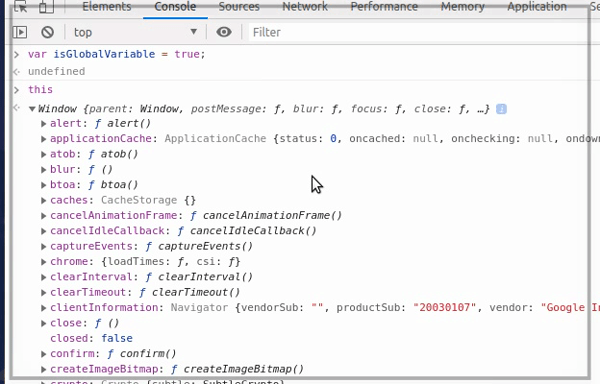

## Scope কি?

মোটামুটি সব গুলা প্রোগ্রামিং ল্যাঙ্গুয়েজে কিছু fundamental paradigms আছে, scope তার মধ্যে একটা। Scope এর মাধ্যমে প্রোগ্রাম থেকে variables এবং functions এর কোথায় access বা visibility আছে আর কোথায় access বা visibility নাই এইটা বোঝা যাবে। 

আর, কিভাবে এই scope কাজ করে এইটা বোঝা অনেক জরুরি। JavaScript এ ২ ধরণের scope আছে।

	- Global Scope (গ্লোবাল স্কোপ)
	- Local Scope (লোকাল স্কোপ)

## Global Scope(গ্লোবাল স্কোপ)

আপনি একটা ডকুমেন্ট open করে JavaScript code লেখা শুরু করেছেন মানে আপনি code টা global scope এ লিখছেন। NodeJs এর ক্ষেত্রে বেপার টা একটু অন্য রকম। NodeJs এর টপ লেবেল স্কোপ ব্রাউজার এর গ্লোবাল স্কোপ এর মতো না, এইটা শুধু মাত্র ওই module এর মধ্যে global। গ্লোবাল স্কোপ এ declare করা variables, functions কোডের যেকোনো জায়গা থেকে application এর লাইফ টাইম পর্যন্ত access করা যায়। 

ব্রাউজার থেকে [DevTools open] করে নিচের code টা গ্লোবাল স্কোপ এ অ্যাড করে দেখি। 

```js
var isGlobalVariable = true;
```
এখন ব্রাউজার এর global object `this` টা দেখলে আমাদের declare করা variable টা ওইখানে পাবো, যেটা সব খান থেকে accessible।



Global scope এ আমরা কখনো variable declare করবো না, করলে অন্য developer এর declare করা variable এর সাথে collisions হতে পারে। 
> হাজার হাজার developer এর লক্ষ লক্ষ variable, collision হয়ে যেতেই পারে 😜। 


## Local Scope (লোকাল স্কোপ) 


[DevTools open]: <https://developers.google.com/web/tools/chrome-devtools/open>